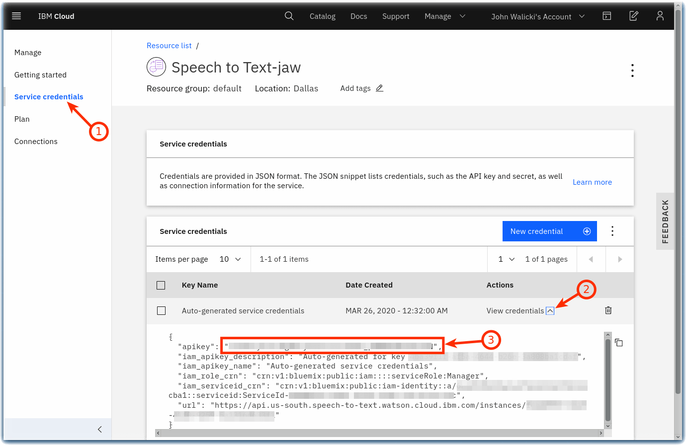
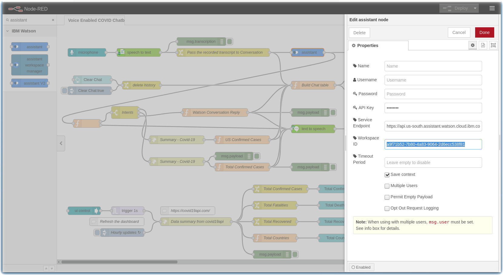
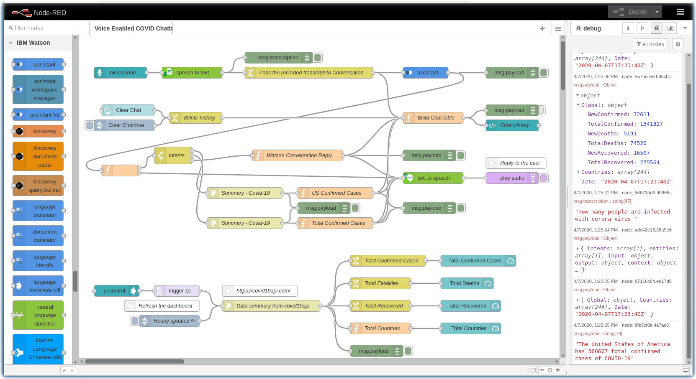

###

Learn how to create a voice enabled chatbot using Node-RED and the Watson Assistant, Watson Speech to Text, and Watson Text to Speech services.

## Learning objectives

In this tutorial, you will:

- Learn about Node-RED (local and on IBM Cloud)
- Explore the node-red-node-watson Node-RED nodes
- Import / Deploy the Watson Assistant example
- Build a Call for Code COVID Crisis Communications voice enabled Chatbot solution

## Prerequisites

- Node-RED installed [locally](https://nodered.org/docs/getting-started/) or [Create a Node-RED Starter application](https://developer.ibm.com/components/node-red/tutorials/how-to-create-a-node-red-starter-application/) in the IBM Cloud
- Once Node-RED is installed, add the dependencies:

```
npm install node-red-contrib-browser-utils node-red-dashboard node-red-node-watson node-red-contrib-play-audio
```

## Estimated time

Completing this tutorial should take about 30 minutes.

## Architecture Diagram

### Voice enabled Crisis Communications Chatbot using Node-RED


1. User visits a voice enabled Node-RED website with the COVID-19 chatbot and asks a question
2. Node-RED records the speech wav file and calls the Watson Speech to Text service hosted in IBM Cloud
3. Watson Speech to Text uses ML to decode the user's speech
4. Watson Speech to Text replies with a transcript of the COVID-19 question and Node-RED calls Watson Assistant service hosted in IBM Cloud
5. Watson Assistant uses NLU and ML to extract entities and intents of the user question
6. Check external data sources for COVID information
7. Watson Assistant invokes an OpenWhisk open source powered IBM Cloud Function
8. IBM Cloud Function calls Watson Discovery service running in IBM Cloud
9. Watson Discovery scans news articles and responds with relevant articles
10. Watson Assistant replies to the user inquiry and Node-RED sends the text transcript to Watson Text to Speech
11. Watson Text to Speech encodes the message in the user's language
12. Node-RED plays the chat answer wav file to the user
13. User listens to the chat answer


## Steps

### Learn about Node-RED

[Node-RED](http://nodered.org) is an open source programming tool for wiring together hardware devices, APIs, and online services in new and interesting ways. It provides a browser-based editor that makes it easy to wire together flows using the wide range of nodes in the palette that can be deployed to its runtime in a single-click.

Follow these instructions to install Node-RED [locally](https://nodered.org/docs/getting-started/) or [Create a Node-RED Starter application](https://developer.ibm.com/components/node-red/tutorials/how-to-create-a-node-red-starter-application/) in the IBM Cloud

### Install Node-RED Dependencies nodes
Once Node-RED is installed, add the dependencies for this tutorial:
- [node-red-contrib-browser-utils](https://flows.nodered.org/node/node-red-contrib-browser-utils)
- [node-red-dashboard](https://flows.nodered.org/node/node-red-dashboard)
- [node-red-node-watson](https://flows.nodered.org/node/node-red-node-watson)
- [node-red-contrib-play-audio](https://flows.nodered.org/node/node-red-contrib-play-audio)
```
npm install node-red-contrib-browser-utils node-red-dashboard node-red-node-watson node-red-contrib-play-audio
```

### Explore node-red-node-watson Node-RED nodes

The [node-red-node-watson GitHub repository](https://github.com/watson-developer-cloud/node-red-node-watson) includes a collection of Node-RED nodes for IBM Watson services.  This package adds the following nodes to your Node-RED palette:

- Assistant (formerly Conversation)
  - Add conversational capabilities into applications
- Discovery
  - List environments created for the Discovery service
- Language Identification
  - Detects the language used in text
- Language Translator
  - Translates text from one language to another
- Natural Language Classifier
  - Uses machine learning algorithms to return the top matching predefined classes for short text inputs
- Natural Language Understanding
  - Analyze text to extract meta-data from content such as concepts, entities, keywords ...
- Personality Insights
  - Use linguistic analytics to infer cognitive and social characteristics from text
- Speech To Text
  - Convert audio containing speech to text
- Text To Speech
  - Convert text to audio speech
- Tone Analyzer
  - Discover, understand, and revise the language tones in text
- Visual Recognition
  - Analyze visual appearance of images to understand their contents

### Import / Deploy the Watson Assistant example

Now that you have installed the Node-RED dependencies, Watson nodes are available to integrate Watson AI services. Let's build a voice enabled chatbot example that uses Watson Assistant, Watson Speech to Text and Watson Text to Speech.

Import this [flow](/starter-kit/node-red/flows/Node-RED-Voice-Enabled-Chatbot.json) and **Deploy** the flow.


### Create Watson Services on IBM Cloud

Before the flow will execute successfully, the Watson Assistant and Watson Speech nodes need to be configured with new service instances and API Keys.

#### Create a Watson Assistant service instance

- If you haven't already, create a [Watson Assistant service instance](https://cloud.ibm.com/catalog/services/watson-assistant)
 
- Follow these [instructions](/README.md) to provision a Watson Assistant chatbot for COVID-19

#### Create a Watson Speech to Text service instance

- Create a Watson Speech to Text service instance by following this [link](https://cloud.ibm.com/catalog/services/speech-to-text) to the IBM Cloud Catalog
- Click on the Create button


- The Node-RED Watson Speech to Text node will need the apikey credentials for this new instance
- Once the Watson Speech to Text service has been created, click on **Service credentials** (1)
- Click the **View credentials** (2) twistie
- Copy the **apikey** (3) for use in the next section
  

#### Create a Watson Text to Speech service instance

- Create a Watson Text to Speech service instance by following this [link](https://cloud.ibm.com/catalog/services/text-to-speech) to the IBM Cloud Catalog
- Click on the Create button


- The Node-RED Watson Text to Speech node will need the apikey credentials for this new instance
- Once the Watson Text to Speech service has been created, click on **Service credentials** (1)
- Click the **View credentials** (2) twistie
- Copy the **apikey** (3) for use in the next section
  

### Enable Watson Speech Nodes with API keys

- Double click on the **speech to text** node and paste the API key from the Watson Speech to Text service instance
- Click on the Done button


- Double click on the **text to speech** node and paste the API key from the Watson Text to Speech service instance
- Click on the Done button


### Enable Watson Assistant node with the COVID-19 Workspace ID and API Key

- Double click on the **assistant** node and paste the Workspace ID and the API key from the Watson Assistant service instance
- Click on the Done button


### Parse Intents and invoke API Calls

- Watson Assistant returns the Intents related to your questions
- The **Switch** node routes two Intents to an **http request** node to query an external data source for current COVID statistics
- A **Function** node adds up the summary statistics and builds a sentence to be spoken

### Deploy the Node-RED flows

- Click on the Red **Deploy** button

### Talk to your COVID-19 Crisis Chatbot

- Click on the **microphone** input tab and ask a question about COVID

---

### Build a Node-RED COVID Statistics Dashboard

**Bonus** : This flow includes a Node-RED Dashboard with several gauges to display COVID-19 statistics.

<p align="center">

</p>

## Summary
### Build a Call for Code Crisis Communications solution!

Now that you have completed this tutorial, you are ready to modify these example flows and Node-RED Dashboard to build a [Call for Code COVID Crisis Communications](https://developer.ibm.com/callforcode/getstarted/covid-19/) solution.
