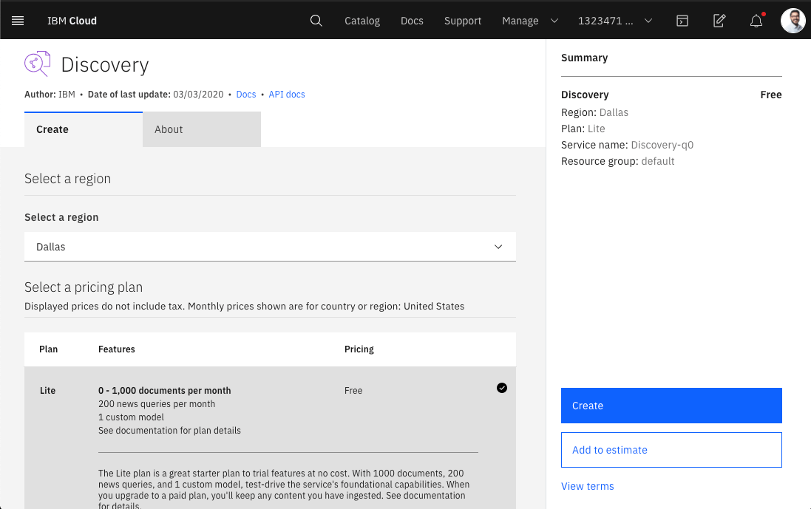
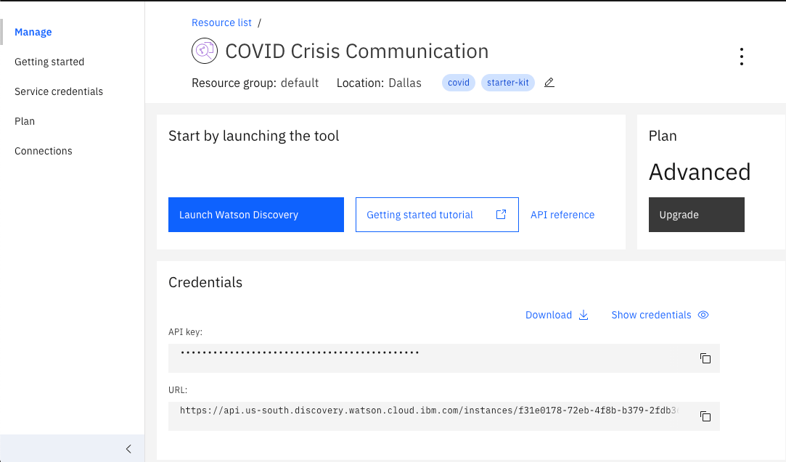
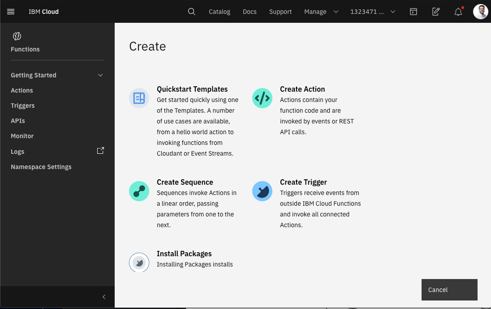
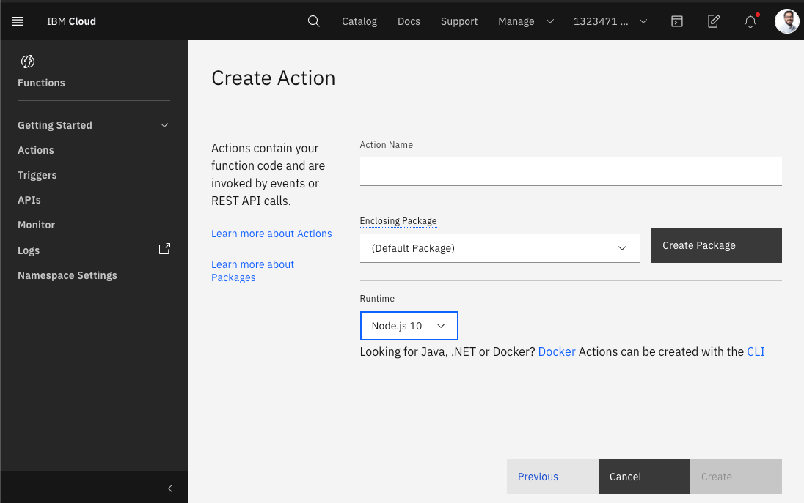
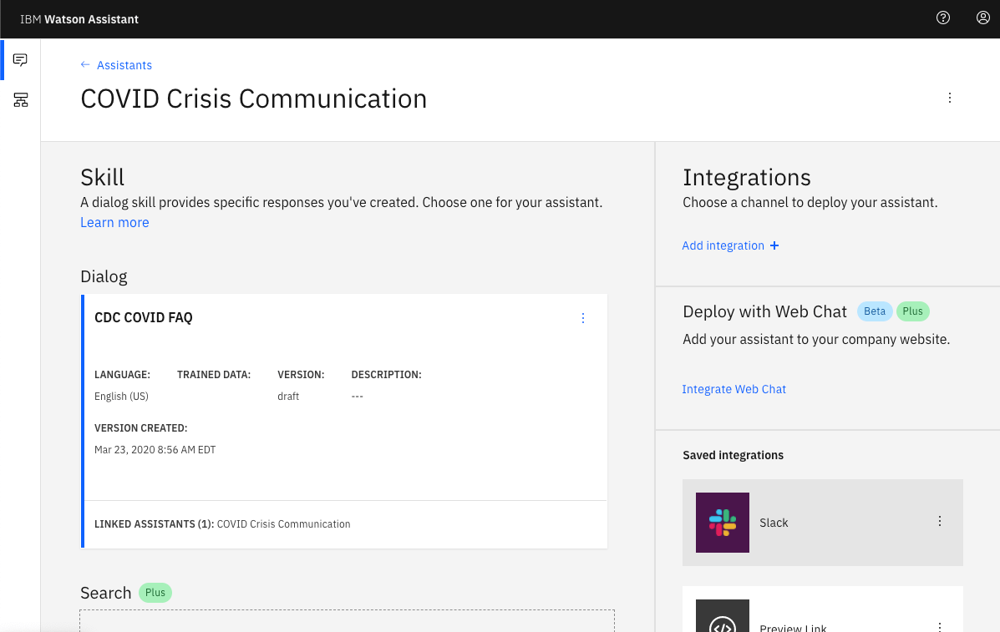
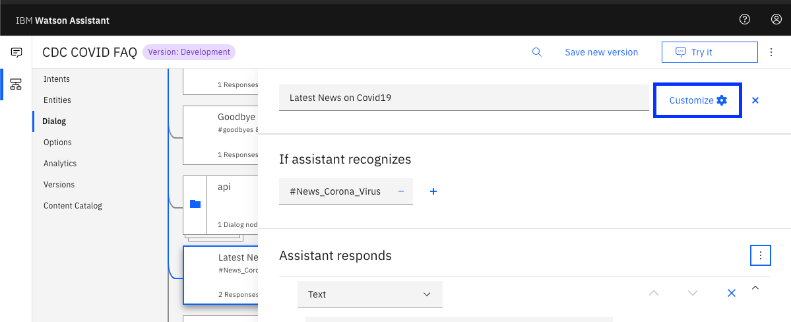

# Adding Webhooks to Watson Assistant

You can query for dynamic data using webhooks in IBM Watson Assistant. Our crisis communication chatbot uses two different sources:

- [Watson Discovery](https://www.ibm.com/cloud/watson-discovery)
- [COVID-19 API](https://covid19api.com/)

## Prerequisites
- Create an [IBM Cloud Account](https://www.ibm.com/account/reg/us-en/signup?formid=urx-42793&eventid=cfc-2020?cm_mmc=OSocial_Blog-_-Audience+Developer_Developer+Conversation-_-WW_WW-_-cfc-2020-ghub-starterkit-communication_ov75914&cm_mmca1=000039JL&cm_mmca2=10008917).
- Access the Watson Assistant instance that you created earlier.

### Make use of Discovery to get news information

1. From your IBM Cloud account, go to Watson Discovery.

2. Create a new lite service

3. Make note of the API-key and the URL. We will need that in the next steps. Click on 

4. Open the Watson Discovery NEWS, which is a prepopulated discovery dataset updated and maintained by the Watson Discovery team. 

5. From the top right corner, open the API tab. Make note of the Collection ID and Environment ID.

### Creating Cloud Functions

1. In the IBM Cloud catalog, go to [IBM Cloud Functions](https://cloud.ibm.com/functions/).

2. Click **Start Creating**.

3. Select **Create Action**.

4. Name your action. For the Runtime dropdown, select **Node.js 10**.

5. Replace the code with [action/covid-webhook.js](./action/covid-webhook.js)

6. On the left, click on the **Parameters** tab. Add the following parameters &mdash; `api_key`, `url`, `collection_id`, and `env_id` &mdash; from the Discovery service that you got from previous steps.

7. Enable the action as a web action. To do so, select the **Endpoints** tab on the left. Click the checkbox beside "Enable as Web Action."

8. Make note of the HTTP URL. You will use this as the webhook for your assistant. You will have to add `.json` in the end of this url to make it work as a webhook.

### Integrate data sources via a Watson Assistant webhook

- For detailed instructions on how to do this, check out our documentation: [Making Programmatic Calls from Watson Assistant](https://cloud.ibm.com/docs/assistant?topic=assistant-dialog-webhooks).

1. Bring up the COVID-19 assistant you created earlier. Find it in your IBM Cloud account under services > IBM Watson Assistant.

2. Click on **Options** on the left.

3. Under Options > Webhooks, in the URL text box, paste the URL from the Cloud Funciton step. Make sure to add a `.json` at the end of the URL.

4. Select **Dialog** on the left navigation.

5. Open up any dialog node you want to add a webhook call for. 

6. After selecting the node, click **Customize**.

7. Enable Webhooks by moving the toggle button to **On** in the Webhooks section. Click **Save**.

8. Add any parameter your webhook needs. These will be sent as query parameters.

9. Test that your webhook integration is working by going to the Try It tab and initiating a dialog that calls the webhook.

You can easily use webhooks to give your Watson Assistant access to many external APIs and databases.
