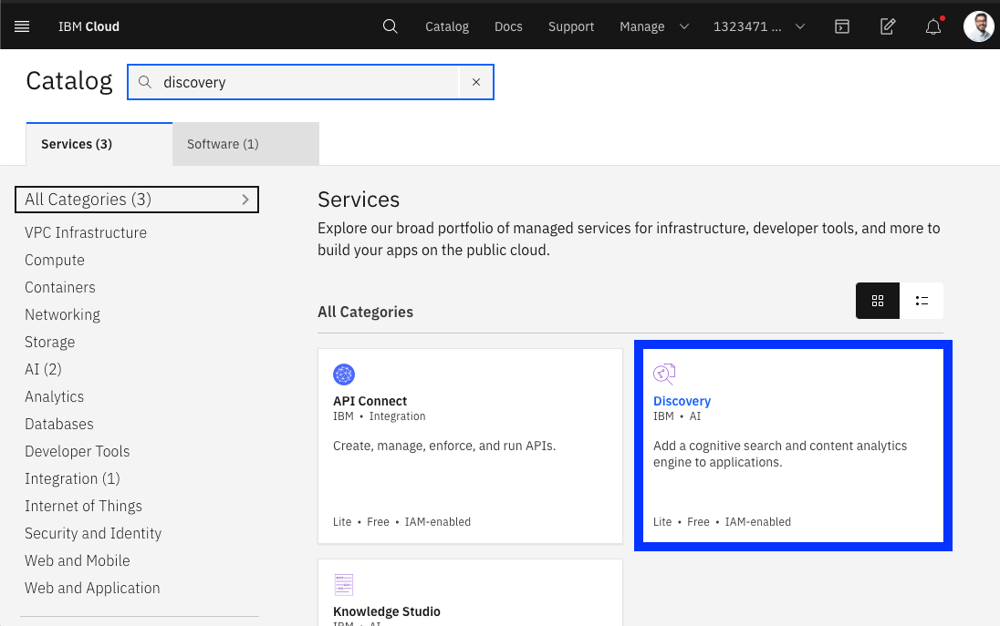
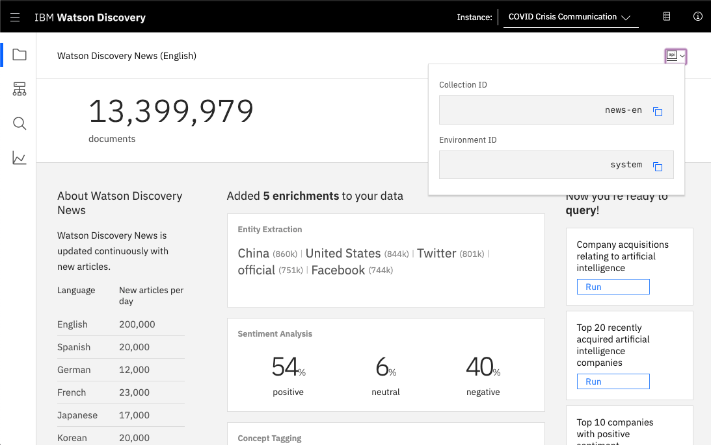
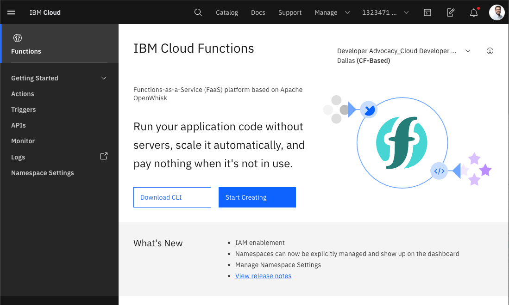
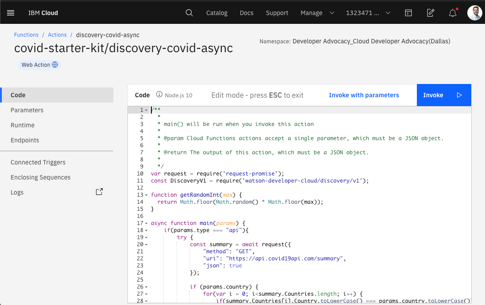
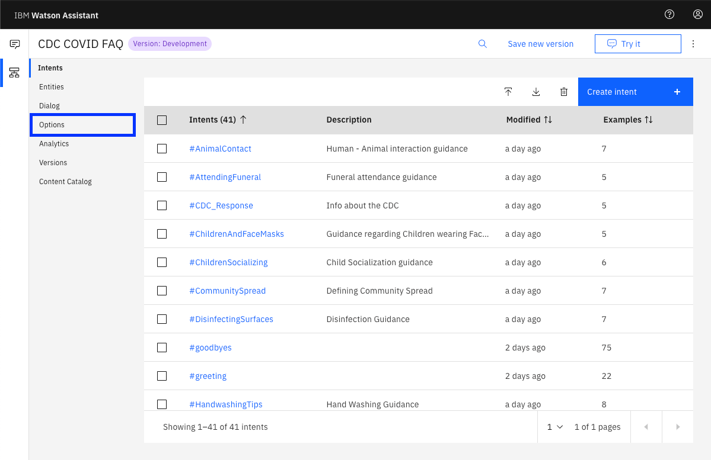
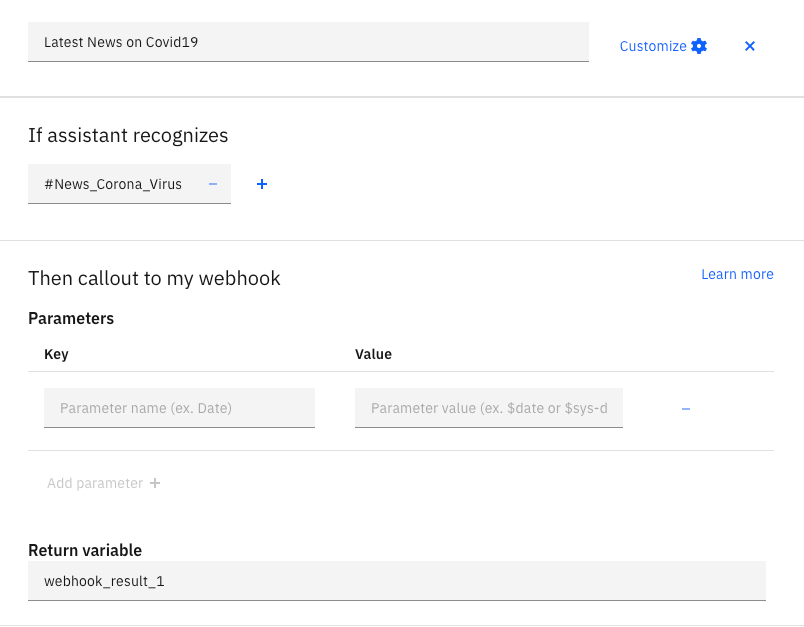
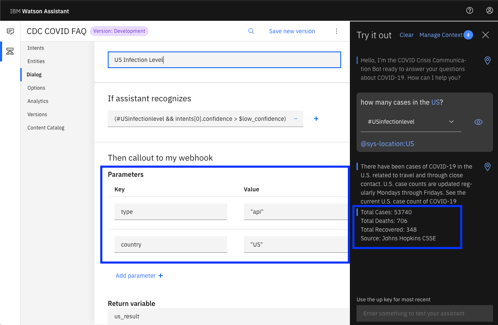

# Adding Webhooks to Watson Assistant
We can query for dynamic data using webhooks in watson assistant. For our chatbot we are going to use two different sources. 
- [Watson Discovery](https://www.ibm.com/cloud/watson-discovery)
- [COVID-19 API](https://covid19api.com/)

## Prerequisites
- IBM Cloud Account
- Watson Assistant Instance

### Make use of Discovery to get News Information
1. Go to Watson Discovery

2. Create a new lite service

3. Make note of the API-key and the URL. We will need that in the next steps. Click on 

4. Open the Watson Discovery NEWS. A prepopulated discovery dataset updated and maintained by the discovery team. 

5. From the top right corner open the api tab. Make note of the Collection ID and Environment ID. 

### Creating Cloud Functions
1. Go to [IBM Cloud Functions](https://cloud.ibm.com/functions/)
2. Click on Start Creating

3. Select Create Action

4. Give it a name. For Runtime select Node.js 10.

5. Replace the Code with [action/covid-webhook.js](./action/covid-webhook.js)

6. Go to parameters on the left and add the following parameters from the discovery service we got on previous steps.

7. Enable the action as an web action. 

8. Make note of the HTTP URL.

This will be used as the webhook for our assisstant. We will have to add `.json` in the end of this url to make it work as a webhook.

### Integrate Data Sources via a Watson Assistant Webhook

- [Making Programmatic Calls from Watson Assistant](https://cloud.ibm.com/docs/assistant?topic=assistant-dialog-webhooks)

1. Go to the assistant you already created.

2. Go to Options on the left.

3. In the URL text box paste url from the cloud funciton step. Make sure to add a `.json` in the end of the URL.

4. Go to Dialog.

5. Open up any dialog node you want to add webhook call for. 
6. Click on Customize.

7. Enable Webhooks then click save.

8. Add any parameter you webhook needs. These will be sent as query parameters.

9. We can try the webhook integration is working by going to the try it tab and initiating a dialog that calls the webhook.

You can easily use webhooks to give you watson assistant access to many external apis and data bases.